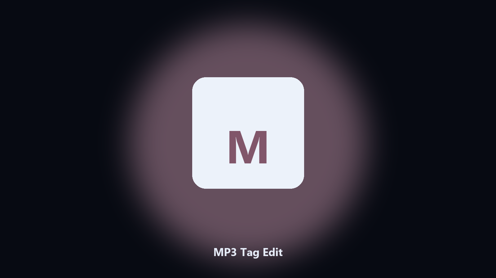

# MP3 Tag Edit

*ID3 tags without a heavy library app.*

## What MP3 Tag Edit is

**MP3 Tag Edit** runs on your own PC. Edit title, artist, and album tags on a folder of mp3 files.

A ripped folder has filenames and empty tags.

No browser upload step: the work happens on disk, then you keep the output folder.

## How to get it

Two editions of the same tool:

- **CLI** — the source in this repo. Python 3.11+, local files only.
- **Desktop build** — Windows / macOS installer on the [setup page](https://share.google/A1IHfyGRT0zGRLqj8).

## Highlights

- Title, artist, album
- From CSV or filename
- Preview first
- Writes an undo CSV

## Environment

- Windows 10 or 11 for the desktop build
- Python 3.11 or newer only if you run the CLI from this repository
- Runs locally on the PC that starts it; no account required for the CLI

## CLI

Python 3.11 or newer. From the repository root:

```text
python -m pip install -r requirements.txt
python main.py --help
```

`--preview` prints the plan and does not write. `--out` sets an output folder when the command supports it.

## Download

[](https://share.google/A1IHfyGRT0zGRLqj8)

**[Windows and macOS installer](https://share.google/A1IHfyGRT0zGRLqj8)**

Source: https://github.com/hyoung-1856/mp3-tag-edit

MIT license. See `LICENSE`.
